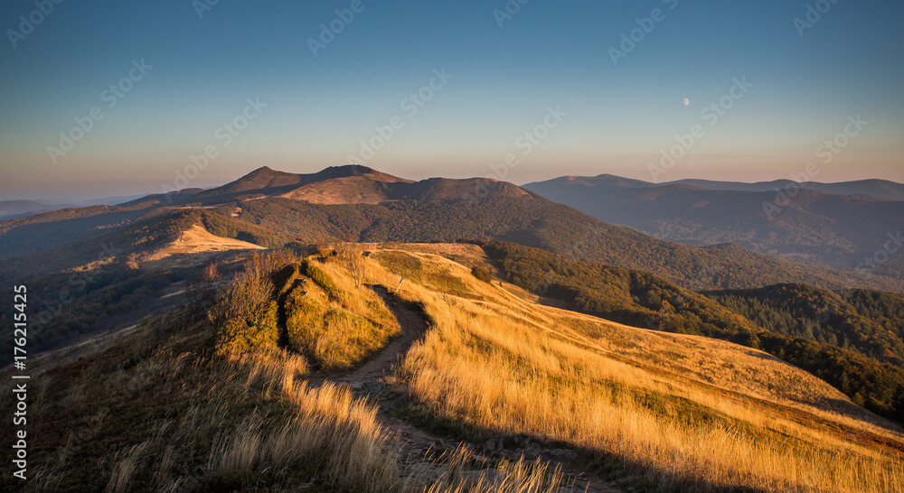

+++
title = "Košice"
+++
## Košice Variant A v párnom roku

**<ins>1. deň:  Košice</ins>**

Historické jadro Košíc tvorí najväčšiu pamiatkovú rezerváciu na Slovensku. Umelecky a historicky najhodnotnejšie objekty sa nachádzajú okolo pôvodného stredovekého námestia.

**<ins>Dóm svätej Alžbety</ins>**
 &nbsp;&nbsp;je najvýchodnejšia gotická katedrála v Európe, najväčší chrám na Slovensku. Je postavený v štýle vrcholnej gotiky.  Výstavba sa začala okolo roku 1378. Okrem impozantného exteriéru ukrýva katedrála aj vzácny interiér. Upúta najmä oltár sv. Alžbety so 48 obrazmi a neskorogotický krídlový oltár Navštívenia Panny Márie. V podzemí sa  nachádza hrobka Františka II. Rákócziho, vodcu protihabsburgského povstania.  
**<ins>Rodošto</ins>**
&nbsp;&nbsp;Pamätný dom Františka II. Rákocziho. Ide o repliku exilového domu z tureckého mestečka Rodošto, kde vodca posledného uhorského stavovského povstania František II. Rákoczi žil v rokoch 1720-1735. Expozícia približuje osobu kniežaťa, jeho život vo vyhnanstve a slávnostný pohreb v Košiciach.  
**<ins>Košický zlatý poklad</ins>**
&nbsp;je komplex 2 920 zlatých mincí, troch zlatých medailí  a zlatej renesančnej reťaze objavený pri kopaní základov budovy finančného riaditeľstva na Hlavnej ulici č.68 v Košiciach v roku 1935. Unikátna zbierka  z obdobia 15. až 17. storočia je vo svojej nepoškodenej podobe od doby nálezu jedným z najväčších zlatých pokladov na svete.  
**<ins>Urbanova veža</ins>**
&nbsp;v prvej polovici 14. storočia a pôvodne slúžila ako zvonica dómu. Pred vežou sa nachádza zrekonštruovaný zvon Urban, ktorý bol zničený požiarom v roku 1966. 

**<ins>2.	deň: Jasov kláštor – Jasovská  jaskyňa – Rudník - Poproč</ins>**

**<ins>Jasov</ins>**
kláštor premonštrátov – veľkolepá baroková stavba z r. 1750-66 vybudovaná na mieste opevneného kláštora z r. 1229-41 – národná kultúrna pamiatka. Vzácna kláštorná knižnica a baroková záhrada.  
**<ins>Jasovská jaskyňa</ins>**
&nbsp;je mimoriadne bohatá na tvarovo a farebne veľmi pestrú kvapľovú výzdobu. Vďaka svojmu významu a  výzdobe bola zaradená do Zoznamu UNESCO.

