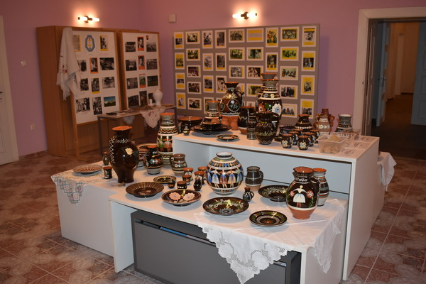

+++
title = "Košice"
+++ 
{#kosice-top}
## Variant A v nepárnom roku {#kosice-neparny .trip-variant}

**Upozorňujeme účastníkov, že poradie výletov sa môže meniť!**

**[Pre párny rok kliknite sem](#kosice-parny)** 
{.text-align-right}

### 1. deň: Košice

Historické jadro Košíc tvorí najväčšiu pamiatkovú rezerváciu na Slovensku. Umelecky a historicky najhodnotnejšie objekty sa nachádzajú okolo pôvodného stredovekého námestia.

**Dóm svätej Alžbety** je najvýchodnejšia gotická katedrála v Európe, najväčší chrám na Slovensku. Je postavený v štýle vrcholnej gotiky. Výstavba sa začala okolo roku 1378. Okrem impozantného exteriéru ukrýva katedrála aj vzácny interiér. Upúta najmä oltár sv. Alžbety so 48 obrazmi a neskorogotický krídlový oltár Navštívenia Panny Márie. V podzemí sa nachádza hrobka Františka II. Rákócziho, vodcu protihabsburgského povstania. 
 <!--  -->

**Rodošto** - Pamätný dom Františka II. Rákocziho. Ide o repliku exilového domu z tureckého mestečka Rodošto, kde vodca posledného uhorského stavovského povstania František II. Rákoczi žil v rokoch 1720 - 1735. Expozícia približuje osobu kniežaťa, jeho život vo vyhnanstve a slávnostný pohreb v Košiciach. 

**Košický zlatý poklad** je komplex 2 920 zlatých mincí, troch zlatých medailí a zlatej renesančnej reťaze objavený pri kopaní základov budovy finančného riaditeľstva na Hlavnej ulici č. 68 v Košiciach v roku 1935. Unikátna zbierka z obdobia 15. až 17. storočia je vo svojej nepoškodenej podobe od doby nálezu jedným z najväčších zlatých pokladov na svete. 

**Urbanova veža** je druhou najstaršou pamiatkou v Košiciach. Postavená bola v prvej polovici 14. storočia a pôvodne slúžila ako zvonica dómu. Pred vežou sa nachádza zrekonštruovaný zvon Urban, ktorý bol zničený požiarom v roku 1966.

### 2. deň: Jasov kláštor – Jasovská jaskyňa - Poproč

**Jasov**
kláštor premonštrátov – veľkolepá baroková stavba z r. 1750 - 1766 vybudovaná na mieste opevneného kláštora z r. 1229 - 1241 – národná kultúrna pamiatka. Vzácna kláštorná knižnica a baroková záhrada. 

**Jasovská jaskyňa** je mimoriadne bohatá na tvarovo a farebne veľmi pestrú kvapľovú výzdobu. Vďaka svojmu významu a výzdobe bola zaradená do Zoznamu UNESCO.

**Poproč** - história a národopisné tradície obce - Izba tradícií. 

### 3. deň: Spišský hrad – Žehra - Hodkovce

**Spišský hrad** - pôvodne kráľovský hrad, jeden z najrozsiahlejších hradných komplexov v strednej Európe. (Pamiatka UNESCO)

**Žehra** - kostol Ducha Svätého je neskororománska sakrálna stavba z druhej polovice 13. storočia. (Pamiatka UNESCO)

**Hodkovce** - barokovo-klasicistický kaštieľ Csákyovcov je sídlom domova sociálnych služieb. Prehliadka je možná v rámci tzv. sociálneho turizmu.

### 4. deň: Dargov - Trebišov – Tokajská vinohradnícka oblasť

**Trebišov** - pôvodne barokový kaštieľ, dal postaviť v roku 1786 gróf I. Csáky.  V 19. st. ho zdedila rodina Andrássyovcov, prestavala ho v neorenesančnom slohu a obklopila parkom s cudzokrajnými drevinami. Pozoruhodnou architektonickou pamiatkou je neogotické mauzóleum rodiny Andrássyovcov z r. 1893 so sarkofágom posledného ministerského predsedu Rakúsko-Uhorska Júliusa Andrássyho.

**Dargov** - pamätník pripomínajúci víťazstvo sovietskej armády v bitke 
o Dargovský priesmyk.

**Vinohradnícka oblasť Tokaj** leží na dolnom Zemplíne v juhovýchodnom cípe Slovenska. Je pokračovaním vinohradníckej oblasti, ktorej väčšia časť sa nachádza v Maďarsku. Táto oblasť je najmenšou a zároveň najatraktívnejšou vinohradníckou oblasťou Slovenska. (Návšteva pivnice spojená s ochutnávkou.) 
Významnou dominantou Tokajskej vínnej cesty je vyhliadková veža v tvare dreveného suda postavená vďaka slovensko – švajčiarskej spolupráce nad obcou Malá Tŕňa. 

 

### 5. deň: Pozdišovce - Močarany – Michalovce - Zemplínska Šírava  

**Pozdišovce** - Pamätník národným dejateľom, Pamätná izba histórie obce, pozdišovská keramika.

 

**Močarany (časť Michaloviec)** - Pamätná izba Gorazda Zvonického. Gorazd Zvonický bol významný básnik katolíckej moderny, prekladateľ, pedagóg, kňaz a misionár. 

**Zemplínska šírava** je vodná nádrž na východnom Slovensku. Je druhou najväčšou vodnou priehradou na Slovensku (po Liptovskej Mare). Okrem rekreácie slúži na zavlažovanie poľnohospodárskej pôdy Východoslovenskej nížiny, na ochranu pred povodňami a ako vodný zdroj pre priemysel. 

**Michalovce** - barokovo-klasicistický kaštieľ rodu Sztárayovcov. Dnes sídlo Zemplínskeho múzea. 

 

## Košice Variant B v párnom roku {#kosice-parny .trip-variant}

**Upozorňujeme účastníkov, že poradie výletov sa môže meniť!**

**[Pre nepárny rok kliknite sem](#kosice-neparny)** 
{.text-align-right}

### 1. deň: Košice - mesto

Kostol najsvätejšej trojice, prehliadka historického centra mesta, archeologické múzeum.

### 2. deň:	Kostol Čečejovce – Rožňava – Betliar

**Ranogotický kostol Čečejovce** pochádza z konca 13. storočia, je zdobený freskami zo 14. storočia. 

**Rožňava** - dominantami námestia sú renesančná strážna veža, radnica, biskupský palác, kláštor vincentiek a budova bývalej banskej komory. 

**Kaštieľ Betliar** - sídlo rodu Andrássyovcov s pôvodným zariadením, vzácnymi zbierkami a historickou knižnicou obklopené nádherným rozsiahlym parkom. Natáčal sa tu seriál 1890.

**Mauzóleum Andrássyovcov Krásnohorské Podhradie** 

### 3. deň: Krásna nad Hornádom - Trebišov - Tokajská vinohradnícka oblasť

**Krásna nad Hornádom** - kaštieľ, expozícia tradičného kroja.

**Trebišov** - barokový kaštieľ prestavaný v neorenesančnom slohu obklopený cudzokrajnými drevinami. Pozoruhodnou architektonickou pamiatkou je neogotické mauzóleum rodiny Andrássyovcov so sarkofágom Júliusa Andrássyho - posledného ministerského predsedu Rakúsko-Uhorska.

**Vinohradnícka oblasť Tokaj** je najmenšou aj najatraktívnejšou vinohradníckou oblasťou Slovenska. Návšteva pivnice spojená s ochutnávkou.

### 4. deň: Smolník – Medzev – Štós kúpele Smolník

**Smolník** - centrum obce je pamiatková zóna - banícke domy, meštianske domy, kostol sv. Kataríny, baroková zvonica, tabaková továreň, kaplnky, trojičný stĺp, (prezentácia s výkladom baníka a s prehliadkou podzemných expozícií).

**Smolnícky tajch** - štvorhektárové jazero v prostredí Volovských vrchov bolo zásobárňou vody pre banskú činnosť v Smolníku.

**Medzev** - múzeum kinematografie rodiny Schusterovej.

**Štós – klimatické kúpele**

### 5. deň: Archeologické nálezisko a múzeum Nižná Myšľa – kaštieľ Šaca - Synagóga Košice

**Nižná Myšľa** - archeologické nálezisko európskeho významu.

**Kaštieľ Šaca** - rokokový kaštieľ z 18. storočia.

**Synagóga Košice** - ortodoxná synagóga predstavuje osobitú kombináciu historických prvkov a prvkov orientálnej architektúry. Expozícia judaík, Galéria Ľudovíta Felda.

**[Pre návrat na vrchol stránky kliknite sem](#to-top-button)** 
{.text-align-right}
