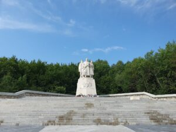

+++
title = "Košice"
+++ 
{#kosice-top}
## Košice Variant A v nepárnom roku {#kosice-neparny}

**<ins>[Pre párny rok kliknite sem](#kosice-parny)</ins>** 
{.text-align-right}

**<ins>1. deň:  Košice</ins>**

Historické jadro Košíc tvorí najväčšiu pamiatkovú rezerváciu na Slovensku. Umelecky a historicky najhodnotnejšie objekty sa nachádzajú okolo pôvodného stredovekého námestia.

**<ins>Dóm svätej Alžbety</ins>**
 &nbsp;&nbsp;je najvýchodnejšia gotická katedrála v Európe, najväčší chrám na Slovensku. Je postavený v štýle vrcholnej gotiky.  Výstavba sa začala okolo roku 1378. Okrem impozantného exteriéru ukrýva katedrála aj vzácny interiér. Upúta najmä oltár sv. Alžbety so 48 obrazmi a neskorogotický krídlový oltár Navštívenia Panny Márie. V podzemí sa  nachádza hrobka Františka II. Rákócziho, vodcu protihabsburgského povstania. 
  

**<ins>Rodošto</ins>**
&nbsp;&nbsp;Pamätný dom Františka II. Rákocziho. Ide o repliku exilového domu z tureckého mestečka Rodošto, kde vodca posledného uhorského stavovského povstania František II. Rákoczi žil v rokoch 1720-1735. Expozícia približuje osobu kniežaťa, jeho život vo vyhnanstve a slávnostný pohreb v Košiciach.  
**<ins>Košický zlatý poklad</ins>**
&nbsp;je komplex 2 920 zlatých mincí, troch zlatých medailí  a zlatej renesančnej reťaze objavený pri kopaní základov budovy finančného riaditeľstva na Hlavnej ulici č.68 v Košiciach v roku 1935. Unikátna zbierka  z obdobia 15. až 17. storočia je vo svojej nepoškodenej podobe od doby nálezu jedným z najväčších zlatých pokladov na svete.  
**<ins>Urbanova veža</ins>**
&nbsp;v prvej polovici 14. storočia a pôvodne slúžila ako zvonica dómu. Pred vežou sa nachádza zrekonštruovaný zvon Urban, ktorý bol zničený požiarom v roku 1966.

**<ins>2.	deň: Jasov kláštor – Jasovská  jaskyňa – Rudník - Poproč</ins>**

**<ins>Jasov</ins>**
kláštor premonštrátov – veľkolepá baroková stavba z r. 1750-66 vybudovaná na mieste opevneného kláštora z r. 1229-41 – národná kultúrna pamiatka. Vzácna kláštorná knižnica a baroková záhrada.  
**<ins>Jasovská jaskyňa</ins>**
&nbsp;je mimoriadne bohatá na tvarovo a farebne veľmi pestrú kvapľovú výzdobu. Vďaka svojmu významu a  výzdobe bola zaradená do Zoznamu UNESCO.

**<ins>3. deň:  Spišský hrad – Žehra - Hodkovce</ins>**

**<ins>Spišský hrad</ins>**
&nbsp;pôvodne kráľovský hrad, jeden z najrozsiahlejších hradných komplexov v strednej Európe. (Pamiatka UNESCO)

**<ins>Žehra</ins>**
&nbsp;kostol Ducha Svätého je neskororománska sakrálna stavba z druhej polovice 13. storočia. (Pamiatka  UNESCO)

**<ins>Hodkovce</ins>**
&nbsp;barokovo-klasicistický kaštieľ Csákyovcov  je sídlom domova sociálnych služieb, prehliadka je možná v rámci tzv. sociálneho turizmu.

**<ins>4. deň:  Dargov - Trebišov – Tokajská vinohradnícka oblasť
Trebišov</ins>**

**<ins>Trebišov</ins>**
&nbsp;pôvodne barokový kaštieľ, dal postaviť v roku 1786 gróf I. Csáky.     V 19. st. ho zdedila rodina Andrássyovcov, prestavala ho v neorenesančnom slohu a obklopila parkom s cudzokrajnými drevinami. Pozoruhodnou architektonickou pamiatkou je neogotické mauzóleum rodiny Andrássyovcov z r. 1893 so sarkofágom posledného ministerského predsedu Rakúsko-Uhorska Júliusa Andrássyho.

**<ins>Dargov </ins>**
&nbsp;pamätník pripomínajúci víťazstvo sovietskej armády v  bitke 
o Dargovský priesmyk.

**<ins>Vinohradnícka oblasť Tokaj  </ins>**
&nbsp;leží na dolnom Zemplíne v juhovýchodnom cípe Slovenska. Je pokračovaním vinohradníckej oblasti, ktorej väčšia časť sa nachádza v Maďarsku. Táto oblasť je najmenšou a zároveň najatraktívnejšou vinohradníckou oblasťou Slovenska. (Návšteva pivnice spojená s ochutnávkou.) Významnou dominantou Tokajskej vínnej cesty  je vyhliadková veža v tvare dreveného suda postavená vďaka slovensko – švajčiarskej spolupráce nad obcou Malá Tŕňa.  

   

**<ins>5. deň:  Pozdišovce (keramika) – Michalovce  - Zemplínska  Šírava     
Pozdišovce</ins>**

## Košice Variant B v párnom roku {#kosice-parny}

**<ins>[Pre nepárny rok kliknite sem](#kosice-neparny)</ins>** 
{.text-align-right}

**<ins>1. deň:  Košice - mesto</ins>**

Kostol najsvätejšej trojice, prehliadka historického centra mesta,  archeologické múzeum

**<ins>2.	Kostol Čečejovce – Rožňava – Betliar</ins>**

**<ins>Ranogotický kostol Čečejovce</ins>**
&nbsp;pochádza z konca 13. storočia, je zdobený freskami zo 14. storočia.  
**<ins>Kaštieľ Betliar</ins>**
sídlo rodu Andrássyovcov s pôvodným zariadením, vzácnymi zbierkami a historickou knižnicou obklopené nádherným rozsiahlym parkom.

**<ins>[Pre návrat na vrchol stránky kliknite sem](#kosice-parny)</ins>** 
{.text-align-right}

