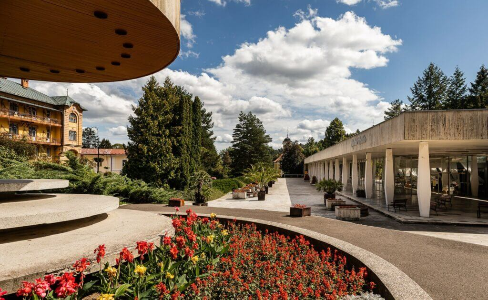
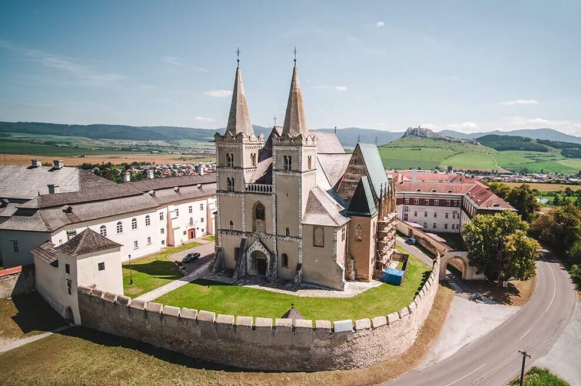

+++
title = "Prešov"
+++

## Variant A (v nepárnom roku) {#presov-neparny .trip-variant}

**Cena: XXX € za ubytovanie** vo vysokoškolskom internáte v 2-posteľových študentských izbách s vlastným sociálnym zariadením a balkónom, (možnosť ubytovania v hosťovských izbách - chladnička, televízor, wifi - za príplatok 7 €/osoba/noc, (kúpeľňa v pôvodnom stave), 10 €/osoba/noc (zrekonštruovaná kúpeľňa)),  **polpenziu** a **dopravu** autobusom počas programu.

**Záujem o hosťovskú izbu je nutné uviesť v prihláške.**

**Upozorňujeme účastníkov, že poradie výletov sa môže meniť!**

**[Pre párny rok kliknite sem](#presov-parny)** 
{.text-align-right}

### 1. deň: Prešov

**Konkatedrála sv. Mikuláša** - postavená je v gotickom štýle, má bohato
zdobené okná. Vo vnútri sa nachádza barokový oltár z konca 17. storočia,
renesančno - barokový organ a renesančná krstiteľnica z červeného mramoru.

**Gréckokatolícky kostol sv. Jána Krstiteľa** má krásne barokové priečelie.

**Židovská synagóga** bola postavená v polovici 19. storočia v maurskom štýle.

**Carrafova väznica** je jedna z mála zachovaných gotických pamiatok v Prešove.
Slúžila ako mestská vináreň, neskôr sa z nej stala väznica a mučiareň.

**Rákocziho palác** je krásna renesančná stavba postavená v 17. storočí. Bola
považovaná za najkrajšiu stavbu Horného Uhorska. Dnes krajské múzeum.

### 2. deň: Sabinov - Hniezdne - Stará Ľubovňa

**Sabinov** - v letných mesiacoch roku 1964 sa v Sabinove nakrúcal film Obchod
na korze, ktorý o dva roky vošiel do dejín československej kinematografie ako
prvý film ocenený zlatou soškou Oscara.

**Sabinovské oltáre** – z dielne Majstra Pavla z Levoče - patria medzi
najvýznamnejšie pamiatky neskorogotického sochárstva na Slovensku.

**Hniezdne Nestville Park** - je expozícia tradičných ľudových remesiel spojená
s prezentáciou histórie a súčasnosti liehovarníctva na severnom Spiši.

**Stará Ľubovňa** - hrad Ľubovňa má bohatú históriu i zaujímavú architektúru.
Počas 360 rokov bol sídlom správcov zálohovaného územia časti Spiša Poľsku.
Najväčšmi sa preslávil početnými kráľovskými návštevami a šesť rokov tu boli
uschované i poľské korunovačné klenoty. Život na dedine v minulosti približuje
návštevníkom múzeum ľudovej architektúry pod hradom.

### 3. deň: Bardejov – Bardejovské kúpele – drevený kostol - Dukla

**Bardejov** je dobre zachované opevnené stredoveké mesto. Dominantou
námestia je Bazilika minor svätého Egídia. Bardejov je preslávený svojím
systémom opevnenia. V roku 2000 bolo historické centrum mesta
zapísané do Zoznamu UNESCO.

**Bardejovské kúpele** sa preslávili minerálnymi vodami, ktoré blahodarne
pôsobia na tráviaci trakt. V kúpeľoch sa liečila druhá manželka cisára
Napoleona I. – Mária Lujza, ruský cár Alexander I. a v roku 1895 cisárovná
Alžbeta, zvaná Sissi.

**Drevený kostolík vo Vyšnom Komárniku** má ikonostas z 18. stor. a oltár s centrálnym obrazom zo 16. stor.

**Dukla** - o Dukliansky priesmyk sa na jeseň 1944 odohrali jedny z najťažších
bojov druhej svetovej vojny. Dnes je na tomto mieste Pamätník 1.&nbsp;československého armádneho zboru s vojnovým cintorínom. Vyhliadková veža stojí na mieste kde mal počas bojov veliteľské stanovisko generál Ludvík Svoboda.

### 4. deň: Solivar – Fintice – Hanušovce nad Topľou

**Solivar (časť Prešova)** - patrí medzi najvýznamnejšie technické pamiatky na
Slovensku. Je to unikátny komplex technických objektov na čerpanie a varenie
soli zo soľanky, pochádzajúci zo 17. stor.

**Fintice** - najvýznamnejšou kultúrno-historickou pamiatkou je renesančný
kaštieľ z prvej pol. 17. stor. Je v ňom galéria a múzeum ľudového umenia.

**Hanušovce nad Topľou** - architektonickou dominantou je renesančno-barokový
kaštieľ, ktorý postavili na prelome 17. a 18. storočia. Jeho charakteristickými
črtami sú výrazné nárožné veže a bohatá štuková výzdoba interiéru a fasády
kaštieľa. Súčasťou Vlastivedného múzea je "zážitkový" archeopark, ktorý
približuje návštevníkom regionálne dejiny staré niekoľko tisícročí.

### 5. deň: Levoča - Spišská Kapitula – Spišské Podhradie

**Levoča** si zachovala charakter stredovekého mesta. Od roku 2009 je zapísaná
na Zozname UNESCO. Najvýznamnejšou a jedinečnou pamiatkou je Chrám
svätého Jakuba s 11 gotickými a renesančnými krídlovými oltármi, vrátane
najvyššieho dreveného gotického oltára na svete (18,6 m) od Majstra Pavla
z Levoče.

**Spišská Kapitula – pamiatka UNESCO**
Dominantou je neskororománska katedrála sv. Martina z rokov 1245 - 1273
s dvoma vežami. Katedrála má mimoriadne cenný interiér - gotické oltáre,
sochy, náhrobky, kalichy, zvony ap. Fresky z roku 1317 znázorňujú korunováciu
kráľa Karola Róberta. Za hodinovou vežou obnovili barokovú biskupskú záhradu.

**Spišské Podhradie** - synagóga je jediná zachovaná na Spiši. Postavená bola v roku 1875 v neskorogotickom slohu s prvkami inšpirovanými orientálnou architektúrou. 

## Variant B (v párnom roku) {#presov-parny .trip-variant}

**Upozorňujeme účastníkov, že poradie výletov sa môže meniť!**

**[Pre nepárny rok kliknite sem](#presov-neparny)** 
{.text-align-right}

### 1. deň: Františkánsky kostol sv. Jozefa - Čierny orol – historické centrum

**Historické centrum mesta Prešov** - je bohaté na kultúrne i historické objekty. Budovy ako Bosákova banka, Caraffova väznica, Evanjelické kolégium, Gréckokatolícky chrám sv. Jána Krstiteľa, Rákocziho palác, radnica či Floriánova brána patria medzi zaujímavé historické objekty, dejiny ktorých siahajú až do 14. storočia.

**Františkánsky kostol svätého Jozefa** - ranobarokový rímskokatolícky kláštorný kostol z konca 14. storočia.

**Čierny orol** - historická budova, pôvodne hostinec a neskôr kultúrne centrum (reduta) postavená na začiatku 19. storočia.

### 2. deň: Krivany centrum ľudovej kultúry – Krivany kamenný vodný mlyn – Ľutina vyhliadková veža, kostol, skanzen drevených kostolíkov, Galéria Mikuláša Klimčáka

**Krivany Centrum ľudovej kultúry** - etnografická expozícia prezentujúca ľudovú tradíciu Šariša, s autentickými sýpkami, drevenicou, remeselníckym dvorom, krojmi a amfiteátrom.

**Krivany kamenný vodný mlyn** - pozoruhodná technická pamiatka zo 17. storočia.

**Ľutina** - najvýznamnejšie pútnické miesto gréckokatolíkov na Slovensku s najstaršou gréckokatolíckou bazilikou minor.

**Ľutina** - Miniskanzen drevených chrámov sú repliky, ktoré patria medzi skvosty ľudovej sakrálnej architektúry z východného Slovenska, Poľska a Ukrajiny.

**Galéria Mikuláša Klimčáka** - Veľkolepá výzdoba Baziliky v Ľutine je dielom humenského rodáka Mikuláša Klimčáka. V blízkosti baziliky otvorili jeho galériu.

### 3. deň: Hervartov – Bardejov Židovské suburbium, pamätník holokaustu – Bardejovské kúpele

**Hervartov** - drevený rímskokatolícky Kostol svätého Františka z Assisi z konca 15. storočia zapísaný v UNESCO. Ide o najstarší a najzachovalejší drevený kostol na Slovensku.

**Bardejov** - Stará synagóga a synagóga Bikur Cholim - Židovské suburbium je významnou pamiatkou židovského dedičstva zapísané v UNESCO.

**Bardejovské kúpele** - sú jedny z najstarších kúpeľov. Prvá písomná zmienka je z roku 1247. Preslávili sa minerálnymi vodami, ktoré blahodarne pôsobia na trávenie. V kúpeľoch sa liečila druhá manželka cisára Napoleona I. – Mária Lujza, ruský cár Alexander I. a tiež cisárovná Alžbeta, zvaná Sissi.

### 4. deň: Plavba loďou po Domaši – Stropkov múzeum – Tokajík Pamätník a Múzeum tokajíckej tragédie

**Vodné dielo Domaša** - bolo vybudované na rieke Ondave v rokoch 1962 - 1967.

**Stropkov** - kaštieľ je posledná zachovaná svetská časť mestského hradu. Jeho najcennejšou časťou je tzv. rytierska sieň.

**Pamätník a Múzeum tokajíckej tragédie** - 19. novembra 1944 zavraždili fašisti 32 nevinných mužov a vypálili obec Tokajík.

### 5. deň: Kaštieľ Petrovany – Opálová baňa Dubník – Expozícia minerálov Opiná

**Kaštieľ Petrovany** - barokovo–klasicistické sídlo baróna Alfonza Vécseyiho a grófa Františka Klobušického.

**Dubník** - opálová baňa je svetovo unikátna, historicky najstaršia opálová baňa na svete.

**Opiná** - v areáli kaštieľa je v podzemí umiestnená Expozícia minerálov a hornín Slanských vrchov.

