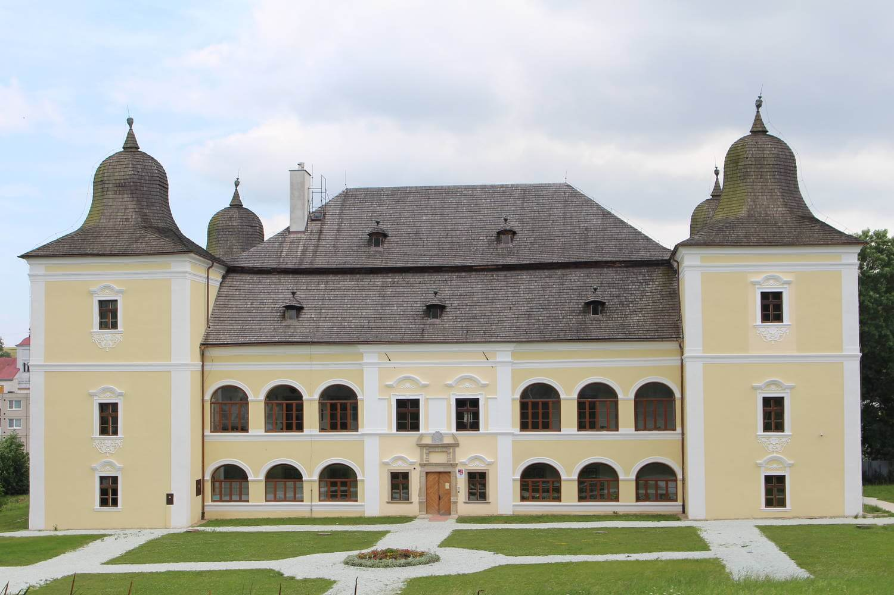

+++
title = "Prešov"
+++

## Variant A v nepárnom roku

**Upozorňujeme účastníkov, že poradie výletov sa môže meniť!**

### 1. deň: Prešov

**Konkatedrála sv. Mikuláša** - postavená je v gotickom štýle, má bohato
zdobené okná. Vo vnútri sa nachádza barokový oltár z konca 17. storočia,
renesančno - barokový organ a renesančná krstiteľnica z červeného mramoru.

**Gréckokatolícky kostol sv. Jána Krstiteľa** má krásne barokové priečelie.

**Židovská synagóga** bola postavená v polovici 19. storočia v maurskom štýle.

**Carrafova väznica** je jedna z mála zachovaných gotických pamiatok v Prešove.
Slúžila ako mestská vináreň, neskôr sa z nej stala väznica a mučiareň.

**Rákocziho palác** je krásna renesančná stavba postavená v 17. storočí. Bola
považovaná za najkrajšiu stavbu Horného Uhorska. Dnes krajské múzeum.

### 2. deň: Sabinov - Hniezdne - Stará Ľubovňa

**Sabinov** - v letných mesiacoch roku 1964 sa v Sabinove nakrúcal film Obchod
na korze, ktorý o dva roky vošiel do dejín československej kinematografie ako
prvý film ocenený zlatou soškou Oscara.

**Sabinovské oltáre** – z dielne Majstra Pavla z Levoče - patria medzi
najvýznamnejšie pamiatky neskorogotického sochárstva na Slovensku.

**Hniezdne Nestville Park** - je expozícia tradičných ľudových remesiel spojená
s prezentáciou histórie a súčasnosti liehovarníctva na severnom Spiši.

**Stará Ľubovňa** - hrad Ľubovňa má bohatú históriu i zaujímavú architektúru.
Počas 360 rokov bol sídlom správcov zálohovaného územia časti Spiša Poľsku.
Najväčšmi sa preslávil početnými kráľovskými návštevami a šesť rokov tu boli
uschované i poľské korunovačné klenoty.  Život na dedine v minulosti približuje
návštevníkom múzeum ľudovej architektúry pod hradom.

### 3. deň: Bardejov – Bardejovské kúpele – drevený kostol - Dukla

**Bardejov** je dobre zachované opevnené stredoveké mesto. Dominantou
námestia je Bazilika minor svätého Egídia. Bardejov je preslávený svojím
systémom opevnenia. V roku 2000 bolo historické centrum mesta
zapísané do Zoznamu UNESCO.

**Bardejovské Kúpele** sa preslávili minerálnymi vodami, ktoré blahodarne
pôsobia na tráviaci trakt. V kúpeľoch sa liečila druhá manželka cisára
Napoleona I. – Mária Lujza, ruský cár Alexander I. a v roku 1895 cisárovná
Alžbeta, zvaná Sisi.

**Drevený kostolík vo Vyšnom Komárniku**

**Dukla** - o Dukliansky priesmyk sa na jeseň 1944 odohrali jedny z najťažších
bojov druhej svetovej vojny. Dnes je na tomto mieste Pamätník
1. československého armádneho zboru s vojnovým cintorínom. Vyhliadková
veža

### 4. deň: Solivar – Fintice – Hanušovce nad Topľou

**Solivar pri Prešove** - patrí medzi najvýznamnejšie technické pamiatky na
Slovensku. Je to unikátny komplex technických objektov na čerpanie a varenie
soli zo soľanky, pochádzajúci zo 17. stor.

**Fintice** - najvýznamnejšou kultúrno-historickou pamiatkou je renesančný
kaštieľ z prvej pol. 17. stor. Je v ňom galéria a múzeum ľudového umenia.

**Hanušovce nad Topľou** - architektonickou dominantou je renesančno-barokový
kaštieľ, ktorý postavili na prelome 17. a 18. storočia. Jeho charakteristickými
črtami sú výrazné nárožné veže a bohatá štuková výzdoba interiéru a fasády
kaštieľa. Súčasťou Vlastivedného múzea je "zážitkový" archeopark, ktorý
približuje návštevníkom regionálne dejiny staré niekoľko tisícročí.

### 5. deň: Levoča - Spišská Kapitula – Spišské Podhradie

**Levoča** si zachovala charakter  stredovekého  mesta. Od roku  2009  je zapísaná
na Zozname  UNESCO . Najvýznamnejšou a jedinečnou pamiatkou je  Chrám
svätého Jakuba  s 11 gotickými a  renesančnými  krídlovými oltármi , vrátane
najvyššieho dreveného gotického oltára na svete (18,6 m) od Majstra Pavla
z Levoče.

**Spišská kapitula – pamiatka UNESCO**
Dominantou je neskororománska katedrála sv. Martina z rokov 1245 - 1273
s dvoma vežami. Katedrála má mimoriadne cenný interiér - gotické oltáre,
sochy, náhrobky, kalichy, zvony ap. Fresky z roku 1317 znázorňujú korunováciu
kráľa Karola Róberta.Za hodinovou vežou obnovili barokovú biskupskú záhradu.

**Spišské Podhradie synagóga**

